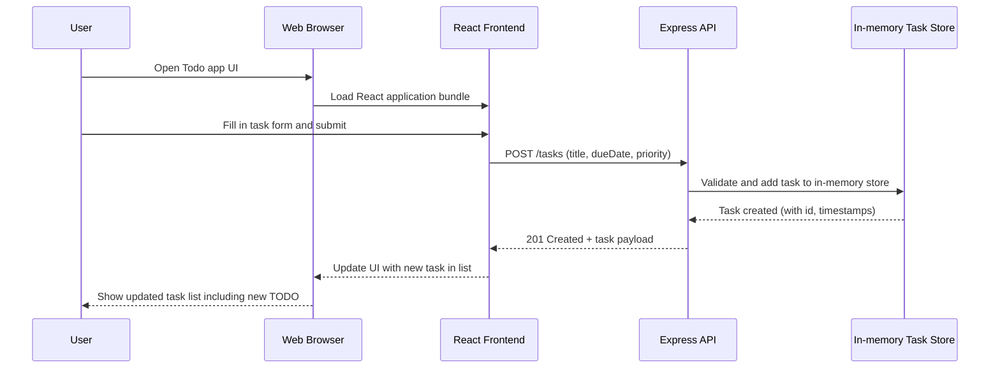

# Cloud Architecture Overview - Todo App Monorepo

This document provides a high-level system context for the Todo application implemented in this monorepo. The system consists of a React frontend, an Express.js API, and an in-memory data store used by the backend.

```mermaid
graph TD
  U[User] --> B[Web Browser]
  B --> FE[React Frontend (packages/frontend)]
  FE --> API[Express API Server (packages/backend)]
  API --> MEM[(In-memory Task Store)]
```

- **User / Browser**: End users interact with the Todo app through a web browser.
- **React Frontend**: The SPA served to the browser, responsible for UI, task creation/editing, and invoking backend APIs.
- **Express API Server**: Handles HTTP requests from the frontend, applies business rules, and manages task data.
- **In-memory Task Store**: Simple runtime data store (e.g., in-memory arrays/objects) maintained by the Express server for task persistence during the process lifetime.

## Sequence: Create a TODO

The following sequence diagram illustrates the flow when a user creates a new TODO item.


